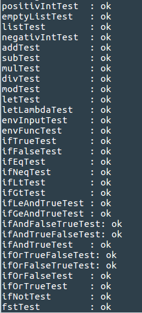

# Interpreter języka pp6 
<i>Metody Programowania, semestr letni 2016/2017 II UWr</i>  
<i>Język Programowania: Haskell</i>  
 
 
Sprawdzaczkę należy uruchomić w katalogu w którym znajdują się testy i rozwiązanie, poleceniem:  
Kompilacja: <i>ghc Prac6.hs</i>  
Uruchomienie testów: <i> ./Prac6 -t </i> 
Uruchomienie programu: <i>./Prac6 [plik.pp6] </i> 
 

<b>Widok po uruchomieniu sprawdzarki:</b> 

